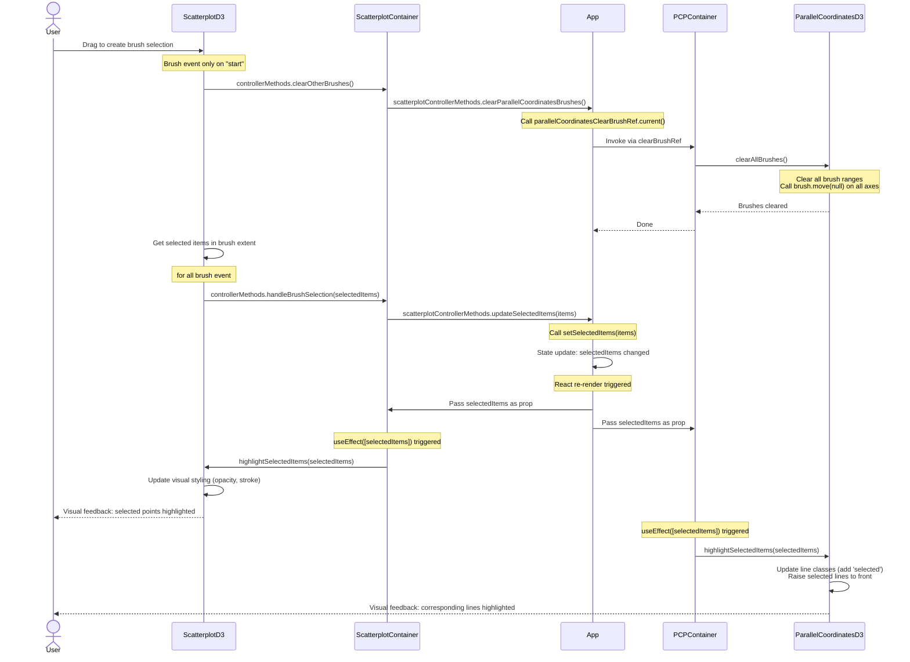

# Scatterplot Brush Selection Sequence Diagram

This diagram shows the complete flow of callbacks and state updates when a user performs a 2D brush selection in the scatterplot.



## Key Points

1. **Brush event initiation**: User interaction in ScatterplotD3 triggers D3's brush event handler
2. **Cross-view brush clearing**: Scatterplot clears PCP brushes via controllerMethods → App's ref
3. **Ref-based communication**: App uses `useRef` to access each container's clear brush function
4. **Selection update**: Selected items are passed to App component via controller methods
5. **State propagation**: React's `setSelectedItems()` triggers re-render with new props
6. **useEffect hooks**: Both containers detect `selectedItems` change and update their D3 visualizations
7. **Bidirectional highlighting**: Both views show visual feedback simultaneously

## Flow Summary

```
User Drag → D3 Brush Event → Clear Other View (via ref) → Update Selection State → 
React Re-render → Props Update → useEffect Triggers → D3 Visual Updates
```
